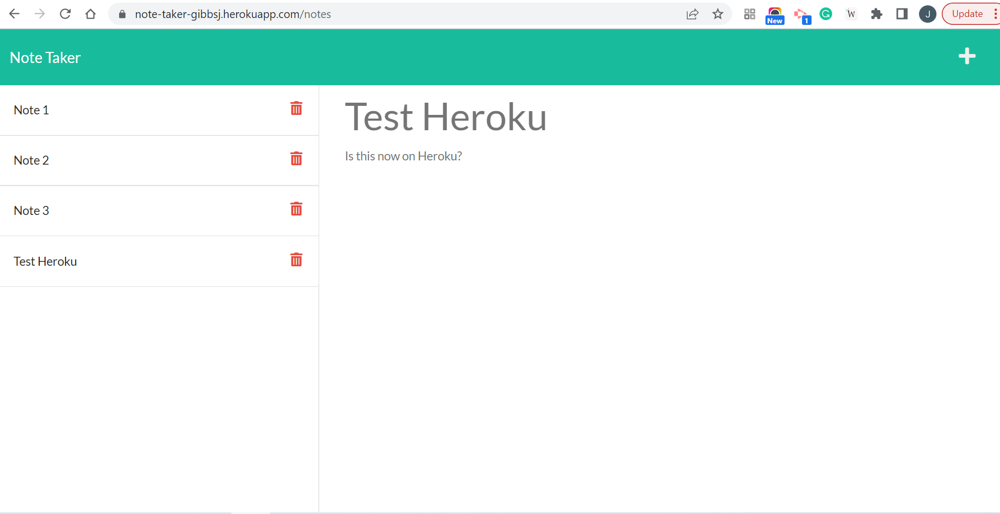

# Assigment: 11 Note Taker

## Table of Contents
[Description](#description)

[Links](#links)

[Questions](#questions)

## Description
The following application routes from the main page to a page where notes are stored for a user. The application allows the user to create notes and then store them to the server. The notes then save throughout time and are able to clicked on for future reference. 

## Links
GitHub Repository: https://github.com/1-those-jacks/note-taker

## Questions
You can reach me at my GitHub Account: 1-those-jacks
You can reach the app via Heroku: https://note-taker-gibbsj.herokuapp.com/  
You can reach me at my Email Address: jackdgibbs1991@gmail.com
